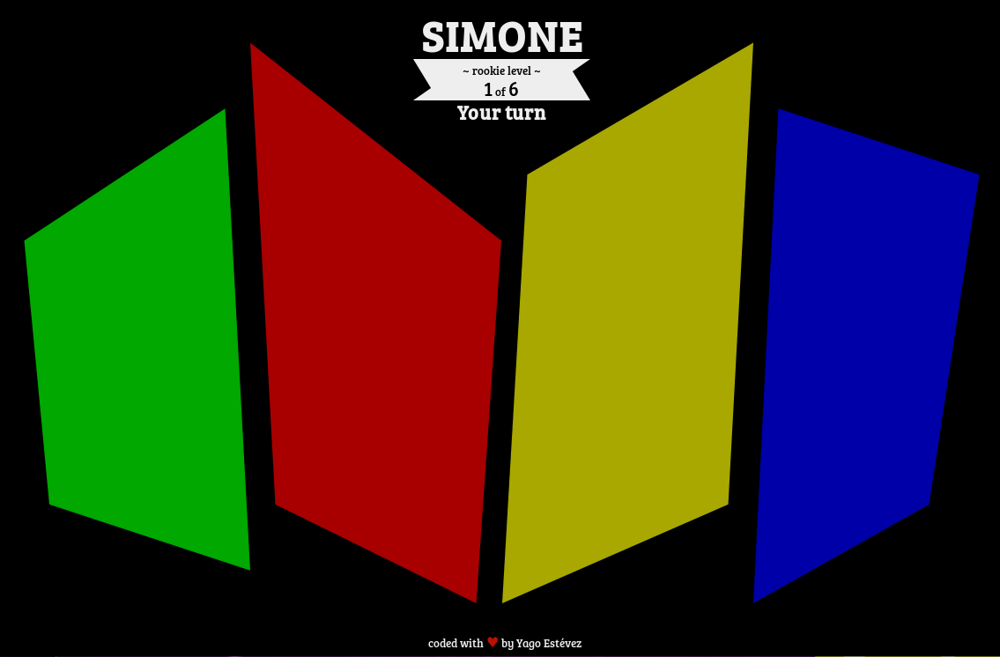

# Simone Game
#### Project made for the old freeCodeCamp curriculum

Another project made for the FreeCodeCamp certificate. This project is no longer required for the new curriculum (June 2018).

I used React on this project.

#### Screenshot

This is how it looks like.

#### User Stories

These are the requirements for this project. They are all fullfilled.

1. I am presented with a random series of button presses.
2. Each time I input a series of button presses correctly, I see the same series of button presses but with an additional step.
3. I hear a sound that corresponds to each button both when the series of button presses plays, and when I personally press a button.
4. If I press the wrong button, I am notified that I have done so, and that series of button presses starts again to remind me of the pattern so I can try again.
5. I can see how many steps are in the current series of button presses.
6. If I want to restart, I can hit a button to do so, and the game will return to a single step.
7. I can play in strict mode where if I get a button press wrong, it notifies me that I have done so, and the game restarts at a new random series of button presses.
8. I can win the game by getting a series of 20 steps correct. I am notified of my victory, then the game starts over.

---

[Yago Estévez](https://twitter.com/yagoestevez)